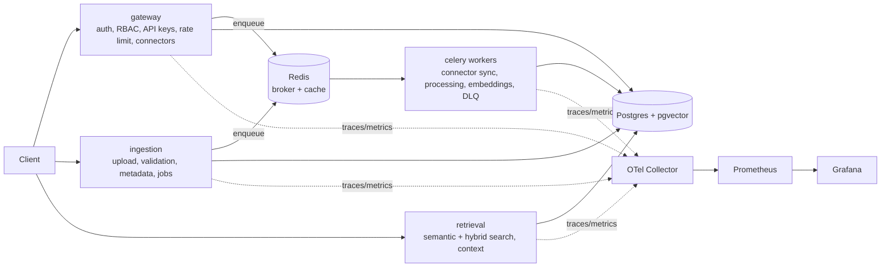

# Enterprise Data Intelligence Platform

A production-grade, Kubernetes-native platform that ingests data from pluggable connectors,
processes it asynchronously, generates embeddings, and serves AI-powered semantic + hybrid
retrieval. Built to demonstrate backend engineering, distributed systems, platform/SRE, and
cloud-native delivery (Helm + ArgoCD GitOps).

> Companion GitOps repo: **data-platform-gitops** (ArgoCD watches it to deploy this app).

## Architecture at a glance



## Tech stack

| Layer | Choice |
|------|--------|
| API | FastAPI (3 services: gateway, ingestion, retrieval) |
| Async | Celery + Redis (broker/result/cache), beat scheduler, DLQ |
| Database | PostgreSQL 16 + `pgvector` (HNSW), async SQLAlchemy 2.0 / asyncpg |
| AI | `sentence-transformers` (pluggable; OpenAI swap via config) |
| Observability | OpenTelemetry, Prometheus, Grafana, Elastic APM, structlog JSON |
| Packaging | Docker, Helm, ArgoCD, kind (local K8s) |
| CI | GitHub Actions (lint, type, test, security scan, image build/push) |

## Repository layout

```
libs/platform_core/      # shared library: config, db, telemetry, security, reliability,
                         #   cache, connectors framework, embeddings, search, pipeline
services/gateway/        # auth, RBAC, API keys, connector management
services/ingestion/      # upload + validation + job tracking
services/retrieval/      # semantic / keyword / hybrid search + context API
workers/                 # Celery app + tasks + beat + DLQ
migrations/              # Alembic migrations (pgvector extension + schema + indexes)
deploy/helm/             # umbrella + per-service Helm charts, per-env values
deploy/kind/             # local kind cluster config
observability/           # otel collector, prometheus, alerts, grafana dashboards
docs/architecture/       # ADRs, diagrams, schema, interview Q&A (per phase)
tests/                   # unit, integration, load (k6), chaos
scripts/                 # seed + helpers
```

## Quickstart (local, Docker Compose)

```bash
cp .env.example .env
make up          # builds images, starts Postgres+pgvector, Redis, MinIO, services, workers, observability
make migrate     # apply DB schema (also runs automatically via the migrate service)
make seed        # create a demo tenant + sample documents

# APIs
open http://localhost:8000/docs   # gateway
open http://localhost:8001/docs   # ingestion
open http://localhost:8002/docs   # retrieval
open http://localhost:3000        # Grafana (anonymous admin)
open http://localhost:9090        # Prometheus
```

### Example flow

```bash
# 1. Bootstrap tenant + admin
curl -s localhost:8000/api/v1/auth/bootstrap -H 'content-type: application/json' \
  -d '{"tenant_name":"Acme","tenant_slug":"acme","admin_email":"a@acme.io","admin_password":"secret123"}'

# 2. Login -> JWT
TOKEN=$(curl -s localhost:8000/api/v1/auth/login -H 'content-type: application/json' \
  -d '{"email":"a@acme.io","password":"secret123"}' | jq -r .access_token)

# 3. Ingest text
curl -s localhost:8001/api/v1/ingest/text -H "authorization: Bearer $TOKEN" \
  -H 'content-type: application/json' \
  -d '{"content":"Kubernetes autoscaling adjusts replicas based on CPU and custom metrics."}'

# 4. Search
curl -s localhost:8002/api/v1/search -H "authorization: Bearer $TOKEN" \
  -H 'content-type: application/json' \
  -d '{"query":"how does autoscaling work","mode":"hybrid","top_k":3}'
```

## Local Kubernetes (kind + Helm + ArgoCD)

```bash
make kind-up && make kind-load
make argocd-install
make helm-install            # or let ArgoCD sync from the gitops repo
```

## Quality gates

```bash
make lint typecheck test security
```

## Documentation

Per-phase deep dives (architecture decisions, tradeoffs, scalability, failure scenarios,
reliability, cost, and interview Q&A) live under [docs/architecture](docs/architecture).

## License

MIT
