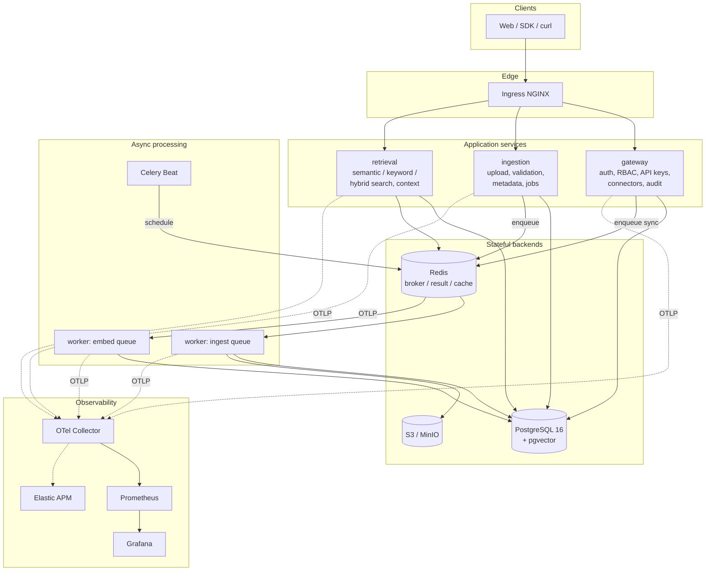
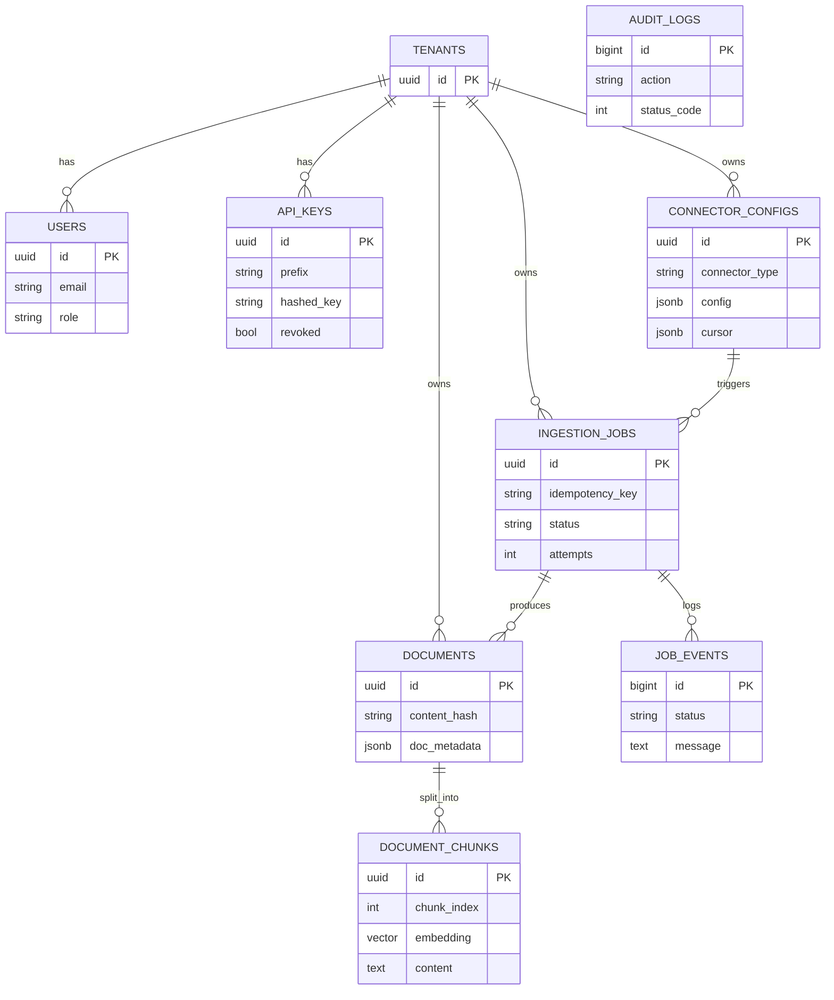
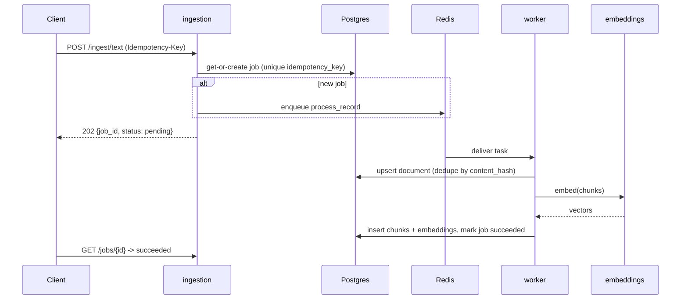
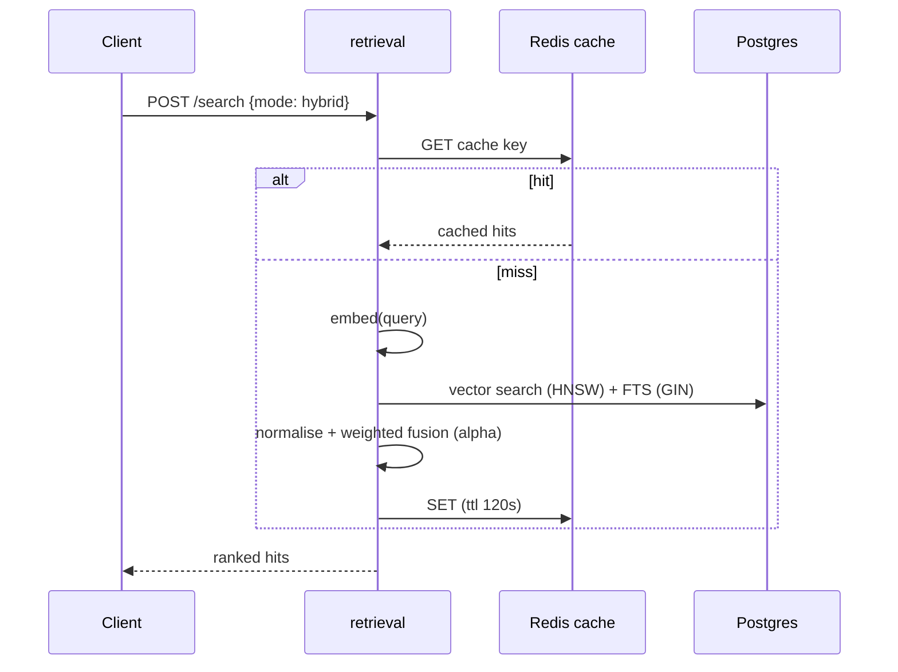
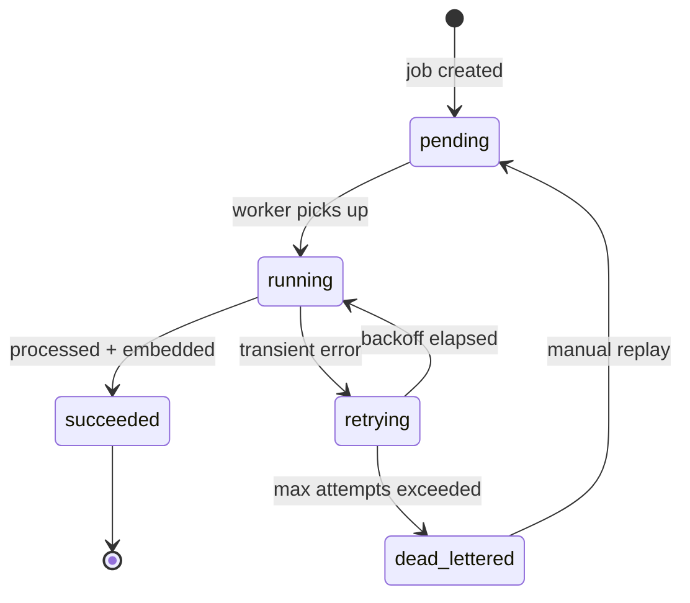

# Architecture

Deep-dive documentation for the Enterprise Data Intelligence Platform.

- [System architecture & data flows](#system-architecture) (this file)
- [Database schema](#database-schema)
- [Sequence diagrams](#sequence-diagrams)
- [Event flow](#event-flow)
- [Architecture Decision Records](decisions.md)
- [Per-phase deep dives](phases.md) - decisions, tradeoffs, scalability, failure scenarios, reliability, cost
- [Interview Q&A](interview-qa.md)
- [Reliability runbook](runbook.md)

## System architecture

### Service boundaries & why

| Service | Responsibility | Scaling driver |
|--------|----------------|----------------|
| gateway | Identity (JWT/API keys), RBAC, connector config, audit | request rate |
| ingestion | Upload, validation, metadata, job orchestration | upload rate / payload size |
| retrieval | Embedding query + vector/keyword/hybrid search | query rate + model memory |
| workers (ingest) | Connector sync, doc processing | queue depth |
| workers (embed) | Embedding generation | queue depth, CPU |

Splitting retrieval from ingestion lets the memory-hungry embedding model scale
independently from the IO-bound upload path, and isolates user-facing search latency from
heavy background processing.

## Database schema

Key indexing decisions:
- `document_chunks.embedding` -> **HNSW** index (`vector_cosine_ops`) for fast ANN search.
- `document_chunks.content` -> **GIN** index on `to_tsvector('english', content)` for FTS.
- `ingestion_jobs (tenant_id, status, created_at)` composite + partial index on pending jobs.
- Uniqueness on `(tenant_id, content_hash)` and `(tenant_id, idempotency_key)` enforces
  idempotency at the database layer.

## Sequence diagrams

### Upload -> async processing -> searchable

### Hybrid search

## Event flow

